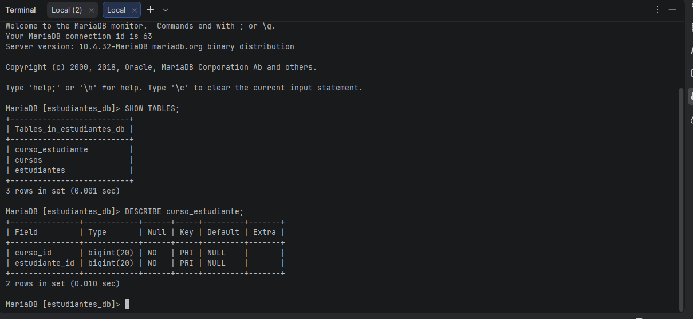
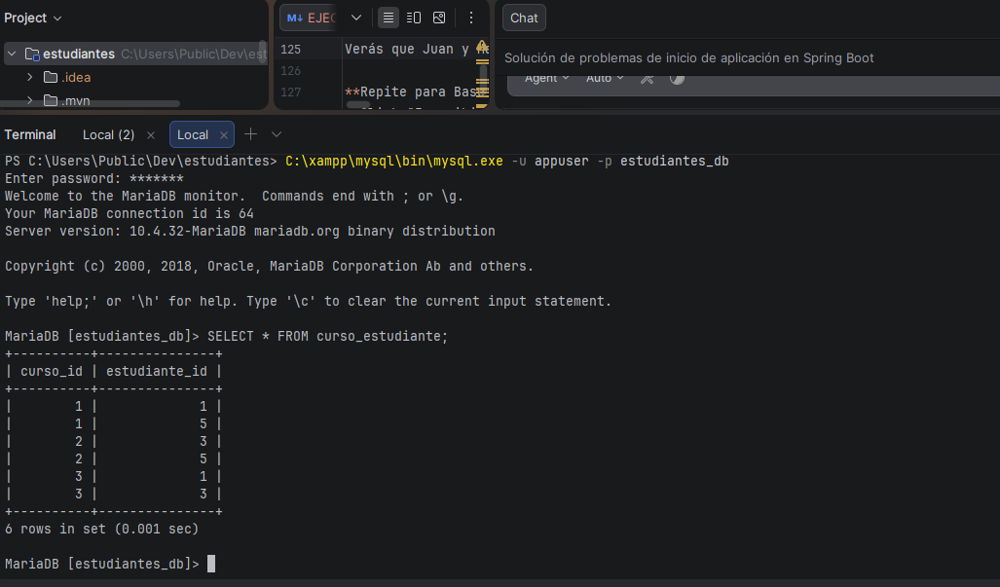
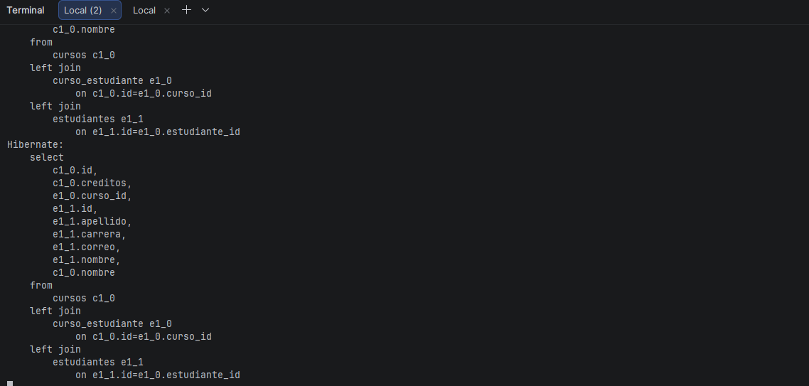

# Gestión de Estudiantes y Cursos - Spring Boot + JPA + MySQL

## Autor

- **Nombre:** Jhoseth Esneider Rozo Carrillo
- **Código:** 02230131027
- **Programa:** Ingeniería de Sistemas
- **Unidad:** 8 Perwsistencia con JPA/Hibernate
- **Actividad:** Post-Contenido 2
- **Fecha:** 19/04/2026

---

## Descripción del Proyecto

Este proyecto consiste en la implementación de una relación muchos a muchos (ManyToMany) entre las entidades Curso y Estudiante utilizando Spring Boot, Spring Data JPA e Hibernate.

El sistema permite gestionar cursos y estudiantes, así como las inscripciones entre ambos, donde:

- Un estudiante puede estar en múltiples cursos
- Un curso puede tener múltiples estudiantes

La relación se implementa mediante una tabla intermedia llamada curso_estudiante.

### Funcionalidades Implementadas

**-Post-Contenido 1:**

- CRUD completo de Estudiantes
- Entidad JPA con validaciones (@NotBlank, @Email, @Size)
- Persistencia en MySQL con Hibernate
- Interfaz web con Thymeleaf

**Post-Contenido 2:**

- Entidad Curso con relación @ManyToMany bidireccional
- Tabla de unión automática `curso_estudiante` con claves foráneas
- Servicio con inscripción/desinscripción transaccional
- Controlador con rutas para gestionar inscripciones
- Plantillas para crear cursos e inscribir estudiantes
- Optimización con JOIN FETCH para evitar problema N+1
- Helper methods para sincronizar relación bidireccional

---

## Tecnologías Utilizadas

- **Spring Boot 3.2.5**: Framework principal
- **Spring Data JPA**: Acceso a datos
- **Hibernate 6.4.4**: Proveedor ORM
- **MySQL 8.x**: Base de datos relacional
- **MySQL Connector/J 8.3.0**: Driver JDBC
- **Thymeleaf 3.1.2**: Motor de plantillas
- **Jakarta Validation 3.0.2**: Validación de datos
- **Java 17**: Lenguaje de programación
- **Maven 3.x**: Gestor de dependencias

---

## Estructura del Proyecto

- src/main/java/com/universidad/estudiantes/
- ├── EstudiantesApplication.java
- ├── controller/
- │ ├── EstudianteController.java → CRUD Estudiantes (Post-1)
- │ └── CursoController.java → CRUD Cursos + Inscripciones (Post-2)
- ├── model/
- │ ├── Estudiante.java → Lado inverso @ManyToMany(mappedBy)
- │ └── Curso.java → Lado propietario @ManyToMany + @JoinTable
- ├── repository/
- │ ├── EstudianteRepository.java → JpaRepository con consultas derivadas
- │ └── CursoRepository.java → JpaRepository con JOIN FETCH
- └── service/
- ├── EstudianteService.java → Lógica negocio estudiantes
- └── CursoService.java → Lógica negocio cursos + inscripciones

- src/main/resources/
- ├── application.properties → Configuración MySQL y JPA
- └── templates/
- ├── estudiantes/
- │ ├── lista.html → Listado de estudiantes
- │ ├── formulario.html → Crear/Editar estudiante
- │ └── confirmar-eliminar.html → Confirmación de eliminación
- └── cursos/
-        ├── lista.html                  → Listado de cursos con cantidad de inscritos
-        ├── formulario.html             → Crear/Editar curso
-        └── inscribir.html              → Gestionar inscripciones (lado izq: inscritos, lado der: disponibles)

---

## Configuración de la Base de Datos

### 1. Crear Base de Datos en MySQL

Ejecuta estos comandos en MySQL:

mysql -u root -p

# Ingresa tu contraseña de MySQL

Dentro de MySQL ejecutar:

sql
CREATE DATABASE estudiantes_db CHARACTER SET utf8mb4 COLLATE utf8mb4_unicode_ci;
CREATE USER 'appuser'@'localhost' IDENTIFIED BY 'apppass';
GRANT ALL PRIVILEGES ON estudiantes_db.\* TO 'appuser'@'localhost';
FLUSH PRIVILEGES;
EXIT;

### 2. Configurar application.properties

spring.datasource.url=jdbc:mysql://localhost:3306/estudiantes_db?useSSL=false&serverTimezone=UTC
spring.datasource.username=appuser
spring.datasource.password=apppass
spring.datasource.driver-class-name=com.mysql.cj.jdbc.Driver

spring.jpa.hibernate.ddl-auto=update
spring.jpa.show-sql=true
spring.jpa.properties.hibernate.format_sql=true
spring.jpa.database-platform=org.hibernate.dialect.MySQL8Dialect

server.port=8080

---

## Relación ManyToMany

La relación entre Curso y Estudiante se define así:

- Curso es el lado propietario
- Estudiante es el lado inverso
- Se utiliza la tabla intermedia curso_estudiante

### Tabla generada

curso_estudiante

curso_id
estudiante_id

---

## Instrucciones de Ejecución

### 1: Ingresar a Mariadb

C:\xampp\mysql\bin\mysql.exe -u root -p

# (Ingresa contraseña de MySQL)

### 2: Ejecutar la Aplicación

En PowerShell, en la carpeta del proyecto:

cd "C:\Users\Public\Dev\estudiantes"
.\mvnw.cmd spring-boot:run

Espera a ver en la consola:

Started EstudiantesApplication in X.XXX seconds

### 3: Acceder a la Aplicación

Estudiantes: http://localhost:8080/estudiantes
Cursos: http://localhost:8080/cursos

---

## CHECKPOINTS DE VERIFICACIÓN

### Checkpoint 1

- Se crean automáticamente las tablas:
  - estudiantes
  - cursos
  - curso_estudiante

### Checkpoint 2

- Se crean cursos y se inscriben estudiantes
- Se verifica en MySQL:

SELECT \* FROM curso_estudiante;

### Checkpoint 3

- Se desinscribe un estudiante
- La relación desaparece de curso_estudiante
- El estudiante sigue existiendo en la tabla estudiantes

---

## Conceptos Clave Implementados

### JOIN FETCH para Evitar N+1

java
@Query("SELECT c FROM Curso c LEFT JOIN FETCH c.estudiantes")
List<Curso> findAllConEstudiantes();

Una sola consulta trae todos los cursos y sus estudiantes.

### Transacciones

java
@Transactional
public void inscribirEstudiante(Long cursoId, Long estudianteId) {
// Garantiza atomicidad (todo se guarda o nada)
}

---

# Capturas del Proyecto

Las siguientes capturas se encuentran en la carpeta `/evidencias/`:

## App corriendo Hibernate genera tabla "curso_estudiante"

## Inscribir estudiantes a cursos

## Desinscribir estudiante y confirmar que la carga de cursos usa JOIN

